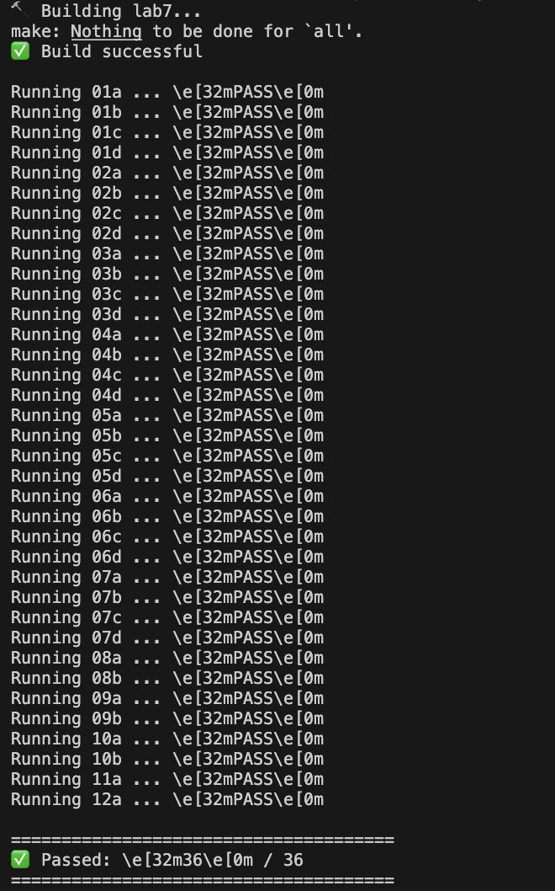

the score:



# 🧠 CPU Scheduling Simulator (Lab 7)

This project implements a **CPU scheduling simulator** supporting multiple classic scheduling algorithms.
It produces both **execution traces** and **statistical summaries**, exactly matching the required lab format.

---

## 📌 Supported Scheduling Algorithms

The simulator supports **8 scheduling policies**:

| ID | Policy | Description                              |
| -- | ------ | ---------------------------------------- |
| 1  | FCFS   | First Come First Serve                   |
| 2  | RR-q   | Round Robin (quantum = q)                |
| 3  | SPN    | Shortest Process Next                    |
| 4  | SRT    | Shortest Remaining Time                  |
| 5  | HRRN   | Highest Response Ratio Next              |
| 6  | FB-1   | Feedback Scheduling (quantum = 1)        |
| 7  | FB-2i  | Feedback Scheduling (increasing quantum) |
| 8  | Aging  | Aging-based Priority Scheduling          |

---

## 📂 Project Structure

```
.
├── lab7.cpp        # Main implementation
├── lab7.h          # Class definitions
├── Makefile        # Build & test automation
├── Dockerfile      # Containerized environment
└── testcases/      # Input/output test cases
    ├── 01a.in
    ├── 01a.out
    ├── 01b.in
    ├── 01b.out
    └── ...
```

---

## ⚙️ Build Instructions

### Compile the project

```bash
make
```

### Run manually

```bash
make run
```

---

## 🧪 Running Test Cases

All test cases inside the `testcases/` folder will be executed automatically and compared using `diff`.

```bash
./run_tests.sh
```

### Output behavior

* ✅ `PASS` → Output matches expected exactly
* ❌ `FAIL` → Shows detailed diff

This matches typical **TA grading scripts**.

---

## 🐳 Docker Support

The project includes a Dockerfile for a clean, reproducible environment.

### Build Docker image

```bash
docker build -t lab7 .
```

### Run all tests inside Docker

```bash
docker run --rm lab7
```

### Interactive shell (optional)

```bash
docker run --rm -it lab7 bash
```

---

## 🧾 Input Format

```
<trace | stats>
<policy list>
<max time>
<number of processes>
<process_name,arrival,service>
...
```

### Example

```
trace
1
20
5
A,0,3
B,2,6
C,4,4
D,6,5
E,8,2
```

---

## 📤 Output Modes

### Trace Mode

* Timeline of execution
* `*` → running
* `.` → ready
* Exact spacing and formatting enforced

### Stats Mode

* Arrival time
* Service time
* Finish time
* Turnaround time
* Normalized turnaround
* Mean values

---

## ✅ Design Notes

* No external libraries
* Deterministic output (diff-safe)
* STL queues and priority queues used
* Strict formatting to match lab samples
* Designed for **automatic grading**

---

## 🧑‍💻 Author

**Omar Elkatan**
Computer Engineering
Operating Systems — CPU Scheduling Lab

